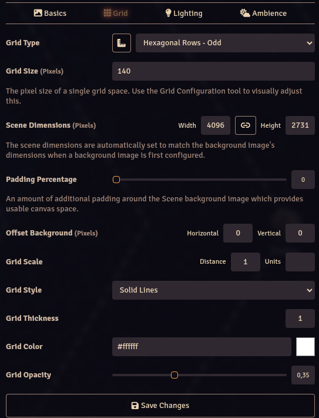

# Ancient Wonders Compendiums for Ironsworn: Starforged


[](https://github.com/jendave/ancient-wonders/releases/latest)


## About

FoundryVTT compendiums for [Ancient Wonders](https://www.drivethrurpg.com/en/product/505365/ancient-wonders) by [Ludic Pen](https://www.ludicpen.com/).

*Ancient Wonders* is a third-party expansion for Starforged with great system-agnostic compatibility.

*Ancient Wonders* can be found at the following links:

* [Drive Thru RPG](https://www.drivethrurpg.com/en/product/505365/ancient-wonders)
* [Itch.io](https://ludicpen.itch.io/)

Please consider joining their [Patreon](https://www.patreon.com/ludicpen/) and [Discord](https://discord.gg/v5j54wsJC6) server for much more RPG content.

## Features and Notes

### The Wondrous Side of the Galaxy Awaits

* *Ancient Wonders* is the biggest third-party expansion for Starforged to date with great system-agnostic compatibility. It provides you with all you need to explore the galaxy in a way that has never been done before, with generators for solar systems, planets, alien megastructures, megacities, and hazardous, otherworldly encounters; all with new mechanics to deepen and twist your adventuring endeavors.
* *Ancient Wonders* is modular: each chapter is independent of each other. You can take whichever you like from the supplement as a standalone expansion. Most are system-agnostic.
* The FoundryVTT module includes roll tables, items, moves and macros in the expansion.

## Module Installation

To install the module, click on `Install Module` and search for `ancient wonders` in the `Add-On Modules` tab of the Foundry VTT game setup screen. Then click on `Install`.

Or use this URL and click on `Install`:

```bash
https://github.com/jendave/ancient-wonders/releases/latest/download/module.json
```

### Install Rolltables

Open the `Ancient Wonders Oracles` compendium and copy the folders to the `Rollable Tables` tab.

### Install Macros

Macros for the expansion can be found in the `Ancient Wonders Macros` compendium. Drag and drop any you need into the macro toolbar. Macros use the current `Roll Mode` when executed.

### Ironsworn/Starforged Tip - Use Custom Folders to add Oracles, Assets and Moves to the Character Sheet

* Use the following method to integrate the `Ancient Wonders Rolltables` into the character sheet.
  * If it does not already exist, create a `Custom Oracles` folder in `Rollable Tables` tab called:
    * `Custom Oracles` - EN
    * `Oráculos personalizados` - ES
    * `Oracles personnalisés` - FR
    * `Własne Wyrocznie` - PL
    * `Свои оракулы` - RU
  * Open the `Ancient Wonders Rolltables` compendium and copy the folders into the `Rollable Tables` `Custom Oracles` folder.
  * 
  * The Oracles will be available in the Character sheet under `Custom Oracles`.
  * 
* Use the following method to integrate the `Ancient Wonders Assets` into the character sheet.
  * Create a `Custom Assets` folder in the `Items` tab called:
    * `Custom Assets` - EN
    * `Recursos Personalizados` - ES
    * `Ressources personnalisées` - FR
    * `Własne Aspekty` - PL
  * Open the `Ancient Wonders Assets` compendium and copy the Items into the `Items` `Custom Assets` folder.
  * The Assets will be available in the Character sheet under `Custom Assets`.
* Use the following method to integrate the `Ancient Wonders Moves` into the character sheet.
  * Create a `Custom Moves` folder in the `Items` tab called:
    * `Custom Moves` - EN
    * `Movimientos personalizados` - ES
    * `Actions personnalisées` - FR
    * `Własne Ruchy` - PL
  * Open the `Ancient Wonders Moves` compendium and copy the Items into the `Items` `Custom Moves` folder.
  * The Moves will be available in the Character sheet under `Custom Moves`.

### Planetary Sector Scene

In the scenes folder, you can find a scene background for a planetary system. It contains orbits and a marker of the
sun's location. In the scene configuration, set the grid to the following settings:



* Grid Type: Hexagonal Rows - Odd
* Grid Size: 140
* Grid Color: #ffffff
* Grid Opacity: 0.35

## Contact

* [Ironsworn/Starforged Discord Server - FoundryVTT Channel](https://discord.com/channels/437120373436186625/867434336201605160) (jendave)
* [FoundryVTT Discord Server - Module Discussion Channel](https://discord.com/channels/170995199584108546/513918036919713802) (jendave)
* [VOID Affiliate Network Discord Server - Game Hacks Channel](https://discord.com/channels/1222986351272787990/1222986351792619687) (jendave)
* [Ludic Pen - General Channel](https://discord.gg/DE6VfxPz) (jendave)
* [GitHub Repository](https://github.com/jendave/ancient-wonders)
* [Itch.io](https://jendave.itch.io/)

## Credits

[Ancient Wonders](https://www.drivethrurpg.com/en/product/505365/ancient-wonders) content by [Ludic Pen](https://www.ludicpen.com/) is used with permission from the author.

Module macro code by David Hudson and licensed for use under the [CC BY-NC-SA 4.0]( https://creativecommons.org/licenses/by-nc-sa/4.0/).

## Acknowledgements

Created for the incredible [Ironsworn and Ironsworn: Starforged](https://tomkinpress.com/) family of games.

[Moves from *Learning From Your Failures in Starforged*](https://tomkinpress.com/blogs/news/learn-from-your-failures-in-starforged) by [Shawn Tomkin](https://tomkinpress.com/) is licensed for use under the [Creative Commons Attribution 4.0 International License (CC-BY)](https://creativecommons.org/licenses/by/4.0/).

[game-icons.net](https://game-icons.net/) are licensed under the [Creative Commons Attribution 3.0 Unported](https://creativecommons.org/licenses/by/3.0/).

### Modules

The following modules were used in the development process

* [DF Manual Rolls](https://foundryvtt.com/packages/df-manual-rolls)

### Utilities

* Interested in more [Ancient Wonders](https://www.drivethrurpg.com/en/product/505365/ancient-wonders) generation tools? Check out [robogeek78](https://github.com/robogeek78)'s [Ancient Wonders System Generator](https://github.com/robogeek78/awGenerator).

## FoundryVTT Modules and Other Resources

Please check out my other modules and resources for Ironsworn, Ironsworn: Starforged and other systems.

### [FoundryVTT](https://foundryvtt.com/community/david-hudson/packages) Modules

* [Starforged Custom Compendiums](https://foundryvtt.com/packages/starforged-custom-oracles)
* [Starsmith Compendiums for Ironsworn: Starforged](https://foundryvtt.com/packages/starsmith-expanded-oracles)
* [Ironsmith Expanded Oracles for Ironsworn](https://foundryvtt.com/packages/ironsmith-expanded-oracles)
* [Augmented Reality Cyberpunk City Kit](https://foundryvtt.com/packages/augmented-reality-foundry)
* [Token Note Hover](https://github.com/jendave/token-note-hover)
* [Token Action HUD Ironsworn](https://foundryvtt.com/packages/token-action-hud-ironsworn)
* [VOID 1680 AM for FoundryVTT](https://foundryvtt.com/packages/void-1680-am)
* [Ancient Wonders](https://foundryvtt.com/packages/ancient-wonders)
* [Rise & Shiningstar - An Adventure for Ironsworn: Starforged](https://foundryvtt.com/packages/rise-and-shining-star)
* [Roll Table Importer](https://foundryvtt.com/packages/roll-table-importer)

### [Itch.io](https://jendave.itch.io/) Resources

* [The City on the Breeze - Cyberpunk-inspired Oracle arrays](https://jendave.itch.io/the-city-on-the-breeze)
* [I'll Be Home for Life Day! - Star Wars Life Day Oracle](https://jendave.itch.io/ill-be-home-for-life-day)
* [Critical Success Oracles](https://jendave.itch.io/critical-success-oracles)
* [I Owe My Soul to the Company Planet Oracles](https://jendave.itch.io/i-owe-my-soul-to-the-company-planet)
* [Creature Rank Generator](https://jendave.itch.io/creature-rank-generator)
